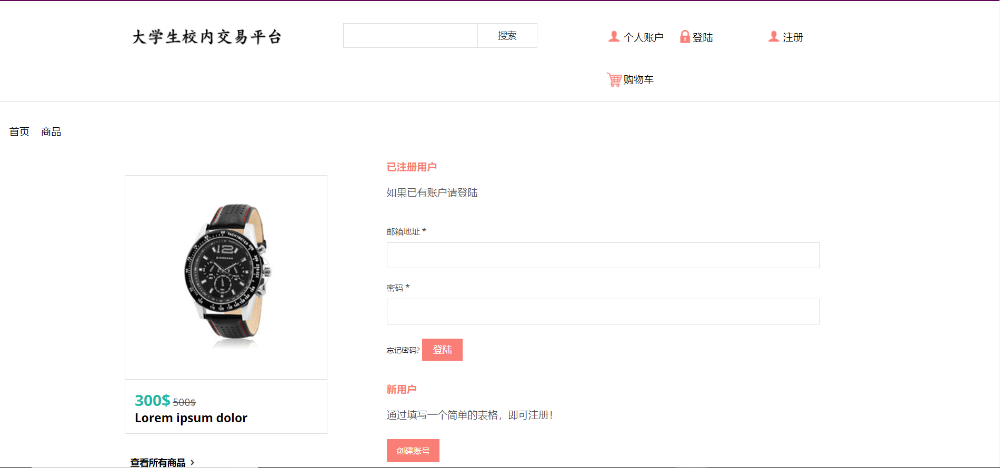

# 金融软件工程小组项目原型设计报告

## 小组成员及分工

- 袁满杰 算法设计
- 韦皓文 界面设计
- 季镇澜 后端实现
- 关一丁 数据支持

## 金融软件名称
NJU大学生校内交易平台

GitHub仓库：https://github.com/njutradingplatform/NJUTradingPlatform

## 1.前言
### 编写目的
说明对程序系统的设计考虑，包括程序系统的基本功能，程序系统的组织结构、模块划分、功能分配、接口设计、运行设计、数据结构设计等，为程序的详细设计奠定基础，并使系统参与者对系统有基本的了解。

### 项目背景
如今随着网络交流的普及，以qq群为媒介的大学生校内交易已愈发频繁，单就南京大学而言便有3个千人大群进行二手交易、外卖拼单等等，每日发布的交易记录有上百起；而其他专项交易群，如天猫超市拼单、某栋宿舍的奶茶拼单等群也有数十个。因此可以说当今大学生群体中这样的p2p线上线下交易合作已成一种趋势，一种生活日常的一部分。
然而目前这样的交易也仍有许多不足之处：
- 千人大群的维护全依靠同学们自觉，属于热心同学的自发奉献行为，因此有一定的不稳定性，而且交易群的纯净性也难以得到保障；
- 目前的平台都是qq群，受限于人数等限制，无法使得全校同学参与，而且上传图片等自由程度受限；
- 以qq群为媒介，信息搜索、浏览都很不便利；
- 现在交易都基于作为同校同学之间的相互信任，存在一定的信用风险，没有中间做市商的信用保障；
- 对于各种不断新生的需求（如学校新开咖啡店的优惠券交易），一般都需要建立新的群，构建新的群体，不方便从已有平台的扩展；
- qq群内信息交流有限，信息不对称加剧；

针对以上现状的不足之处，我们希望能建立一个同校内的交易平台，提供更便捷、更有保障的各种二手物资、优惠券、拼单等交易机会。

### 系统目标
1. 开发意图

   ​		为改善以往主要依托于QQ群的校内交易方式，模仿现有的网络商品交易平台，以方便校园内大学生交易为目标，设计出更贴近校园生活、更简便易用的校内网络交易平台。

2. 应用目标

   1. 总目标

      立足于已有的网络交易平台的成熟技术，使本交易平台能够支持各类校内交易需求，支持现有的主流支付款方式，减少因p2p交易带来的风险问题，为更多潜在用户带来方便。切实地给目标受众，即有买卖物品需求的校内大学生带来方便。

   2. 分期目标

      1. 初期：前端设计，网页页面、交互完成，预计5~7天
      2. 中期：逻辑实现，功能基本完成，预计7~9天
      3. 后期：服务器搭建，功能测试。预计5天

3. 作用范围

   校内使用，目标受众为有买卖物品需求的校内大学生

## 2.运行环境
### 硬件环境
|硬件名称|配置|用途|
|:---:|:---:|:---:|
|应用服务器|个人服务器|用于部署应用、数据库等|
|客户端设备|普通个人计算机|用于用浏览器访问本系统|
### 软件环境
|软件名称|说明|备注|
|:---:|:---:|:---:|
|操作系统|Linux|服务器系统部署|
|WEB服务器|Apache Tomcat|web应用部署|
|数据库服务器|MySQL|数据库部署|
## 3.功能体系和结构
### 项目功能
- 卖方的商品(二手物品、优惠券、拼单等)上架、编辑、接单功能；
- 买方的商品浏览、选购、下单、确认支付功能；
- 卖方与买方对话功能；
- 商品推荐；
- AI客服助手；
- 相关商品的平台(淘宝、京东等)比价推荐；

### 总体结构设计

### 数据流图设计

### 数据字典

|系统各部分及主体名称|输入数据流|输出数据流|简述|
|:--:|:--:|:--:|:--:|
|用户||注册信息、登录信息|用户进行注册、登录等操作|
|网站登录界面|用户进行注册、登录等操作，用户信息|用户信息|接受用户的登录、注册输入并且反馈登录结果的界面|
|用户资料数据库|用户信息|用户信息|用户信息的存储和检验数据库|
|网站主界面|推荐商品|询问客服指令、搜索关键词|网站的首页，提供搜索商品、推荐商品、与客服交互的界面|
|智能客服|询问客服指令，回答信息|问题信息|连接用户与客服数据库之间的媒介，提供最匹配的回答结果|
|客服问题库|问题信息|回答信息|储存用户咨询客服问题的数据库|
|商品资料库|搜索关键词，商品信息|推荐商品，选择指令|储存商品信息的数据库|
|卖家身份|身份选择指令，聊天信息|商品信息，聊天信息|用户选择执行买家各功能时的界面|
|对话框|聊天信息|聊天信息|用户之间进行对话交流的媒介和界面|
|商品信息页|选择指令，比价信息|聊天指令|用户选择商品时展现的界面|
|外界网站商品信息库||比价信息|获取、存储外界相关商品信息的数据库|
|交易界面|操作指令||用户确认支付的界面|
## 4.用户接口设计
本系统包括以下用户接口：
<table>
<tr>
    <td>功能分类</td>
    <td>功能名称</td>
    <td>功能描述</td>
</tr>
<tr>
    <td rowspan=3>用户认证</td>
    <td>注册</td>
    <td>新用户的注册、个人信息填写、设置等</td>
</tr>
<tr>
    <td>登录</td>
    <td>用户登录、认证</td>
</tr>
<tr>
    <td>个人信息</td>
    <td>查看、修改个人信息</td>
</tr>
<tr>
    <td rowspan=4>买家操作</td>
    <td>搜索</td>
    <td>已上架商品、服务的搜索</td>
</tr>
<tr>
    <td>添加购物车</td>
    <td>将商品添加至购物车</td>
</tr>
<tr>
    <td>智能客服咨询</td>
    <td>向智能客服咨询平台使用中遇到的问题</td>
</tr>
<tr>
    <td>购物下单</td>
    <td>确认购物、支付</td>
</tr>
<tr>
    <td rowspan=3>卖家操作</td>
    <td>发布商品</td>
    <td>填写信息，发布新商品</td>
</tr>
<tr>
    <td>编辑商品</td>
    <td>编辑、修改已上架商品的信息</td>
</tr>
<tr>
    <td>接单</td>
    <td>查看订单并填写相应发货信息</td>
</tr>
<tr>
    <td rowspan=1>交互系统</td>
    <td>聊天功能</td>
    <td>买家、卖家之间交流沟通系统</td>
</tr>
</table>

## 5.界面设计
### 首页

### 登录，注册界面

### 单个商品购买界面

### 商品选择界面

### 商家上架货物界面

### 个人的货架

### 我的购物车

## 6.安全设计
### 数据库安全设计
- 通过数据库系统的用户账号与口令鉴定用户的身份，这是系统提供的最外层安全保护措施;
- 合理设置数据库对象的授权粒度，认真研究并大力推行角色权限管理机制，使用具有口令保护的角色，通过应用系统级的身份认证连接数据库，通过应用程序进行角色的口令输入、打开角色并激活角色开关，以避免用户绕过应用程序而直接调用SQL语句访问数据库资源;
- 为不同用户定义不同的视图，通过视图机制把要保密的数据对无权存取这些数据的用户隐藏起来，从而自动地对数据进行保护;
### 密码安全设计
- 加大用户口令的复杂程度，禁止用户不设口令或使用过于简单的口令;
- 设置口令的失效期，以强制用户定期修改口令;
- 必要时可按登录时间、登录机器的IP地址、MAC地址等因素限制用户的访问请求;
- 可设置用户登录多次输入错误密码时锁定该用户;

