# 
大学生校内交易平台测试报告

组员：袁满杰 季镇澜 韦皓文 关一丁

## 一、项目名称
大学生校内交易平台

## 二、项目功能描述

我们实现了用户注册、用户登录、用户修改信息、商品默认展示、商品搜索、查看单个商品、添加到购物车、购物车中的商品增删改查、以及用户之间聊天、智能客服等功能。

 ## 三、测试需求分析

### 各功能输入和输出

|     功能     |                  输入                  |      输出      |
| :----------: | :------------------------------------: | :------------: |
|     注册     | email  password  first_name  last_name | 注册结果状态码 |
|     登录     |             email password             | 登录结果状态码 |
| 用户修改信息 |              要修改的信息              | 修改结果状态码 |
|   商品搜索   |               搜索关键字               |    商品结果    |
| 查看单个商品 |                点击事件                |    商品信息    |
|   用户聊天   |                  信息                  |      信息      |
|  购物车操作  |      点击添加、删除商品按钮 数量       |   购物车信息   |
|   智能客服   |                咨询信息                |    答复信息    |

## 流程图

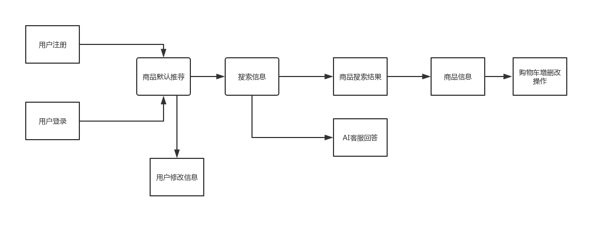

## 四、白盒测试

<table>
    <tr>
        <td>文件</td>
        <td>函数</td>
        <td>点覆盖（输入参数）</td>
    </tr>
    <tr>
    	<td rowspan=4>index.js</td>
        <td>Updateindex(msg)</td>
        <td>msg</td>
    </tr>
    <tr>
    	<td>Cart(initstat)</td>
        <td> initstate </td>
    </tr>
    <tr>
    	<td>Getandshowsearch(input)</td>
        <td>input</td>
    </tr>
    <tr>
        <td>Aisupport(aiinput)</td>
        <td>aiinput</td>
    </tr>
    <tr>
    	<td>Product.js</td>
        <td>Searchproduct(index,msg)</td>
        <td>index msg</td>
    </tr>
    <tr>
        <td rowspan=2>Single.js</td>
        <td>Initsingle(index)</td>
        <td>index</td>
    </tr>
    <tr>
    	<td>Singleaddtocart(username,index)</td>
        <td>username index</td>
    </tr>
    <tr>
        <td rowspan=4>Cart.js</td>
        <td>Initcart(username)</td>
        <td> username</td>
    </tr>
    <tr>
        <td>IfLogin(username,password)</td>
        <td>username password</td>
    </tr>
    <tr>
        <td>ChangePass(newpass)</td>
        <td>newpass</td>
    </tr>
    <tr>
        <td>Register(username,password)</td>
        <td>username password</td>
    </tr>
</table>

####         Updateindex(msg)

流程图：

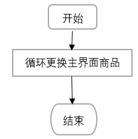

参数的测试用例表：

| Updateindex | 参数msg             |
| ----------- | ------------------- |
| M1          | Msg的Length大于12   |
| M2          | Msg 的Length 小于12 |

测试结果分析：

Updateindex输入的样例均无问题。

####         Cart(initstat)

流程图：

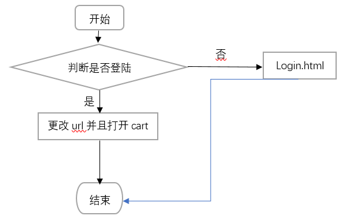

参数的测试用例表：

| Cart | 参数 initstate |
| :--: | :------------: |
|  A1  |  Initstate=1   |
|  A2  |   Initstat=0   |

测试结果分析：

Cart函数输入的测试用例也无问题。

####         Getandshowsearch(input)

流程图：

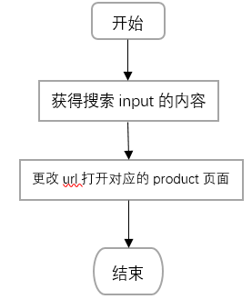

参数的测试用例表：

| Getandshowsearch |          参数 input          |
| :--------------: | :--------------------------: |
|        B1        |          Input为空           |
|        B2        |           Input=1            |
|        B3        |           Input=-1           |
|        B4        |           Input=0            |
|        B5        | Input=’dd’(数据库中不存在的) |
|        B6        |    Input=’p’(数据库存在)     |

测试结果分析：

Getandshowsearch函数测试用例未产生bug。

####         Aisupport(aiinput)

流程图：

 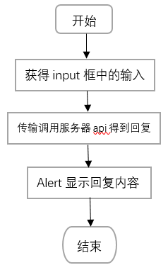

参数的测试用例表：

| Aisupport | 参数aiinput |
| :-------: | :---------: |
|    C1     |     空      |
|    C2     |      1      |
|    C3     |     -1      |
|    C4     |      0      |
|    C5     |     ‘d’     |

测试结果分析：

Aisupport函数缺少对于输入为空的反应，需要添加输入为空，请添加输入的提示函数。

####         Searchproduct(index,msg)

流程图：

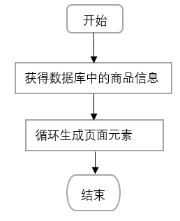

参数的测试用例表：

| searchproduct |  参数 msg  | 参数 index |
| :-----------: | :--------: | :--------: |
|      D1       | Length = 0 |     空     |
|      D2       | Length = 0 |    ‘d’     |
|      D3       | Length = 0 |    ‘p’     |
|      D4       | Length >12 |     空     |
|      D5       | Length >12 |    ‘d‘     |
|      D6       | Length >12 |    ‘p’     |
|      D7       | Length<12  |     空     |
|      D8       |  Length=0  |    ‘d‘     |
|      D9       | Length >12 |    ‘p’     |

测试结果分析：

Searchproduct的输入为空时无任何响应，应该增加对输入为空时的反应机制，其次当输入的为数据库中没有的商品的名称时，未能告知无商品匹配，应该在函数中添加此功能。

####         Initsingle(index)

流程图：

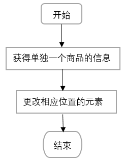

参数的测试用例表：

| Initsingle | 参数 index |
| :--------: | :--------: |
|     E1     |     空     |
|     E2     |   ‘pic6’   |
|     E3     |    ‘p’     |

测试结果分析：

Initsingle函数的输入测试用例均反应正确，对于username的缺失不会影响对单个产品的浏览，并且此时的加入购物车指向的链接为登陆。

####         Singleaddtocart(username,index)

流程图：

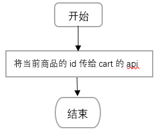

参数的测试用例表：

| singleaddtocart |  参数 username   | 参数 index |
| :-------------: | :--------------: | :--------: |
|       F1        |        空        |     空     |
|       F2        |        空        |   ‘pic6’   |
|       F3        |        空        |    ‘p’     |
|       F4        | 123456789@qq.com |     空     |
|       F5        | 123456789@qq.com |   ‘pic6’   |
|       F6        | 123456789@qq.com |    ‘p’     |

测试结果分析：

Singleaddtocart函数中的测试用例响应正确，会提示添加成功，并且不会在退出登陆后再次登陆时未添加进入数据库失败。

####         Initcart(username)

流程图：

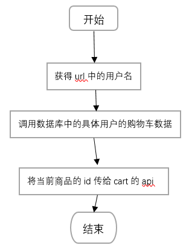

参数的测试用例表：

| Initcart |    参数username    |
| :------: | :----------------: |
|    G1    |         空         |
|    G2    | ‘123456789@qq.com’ |
|    G3    |      ‘pdadsa’      |

测试结果分析：

Initcart函数对于缺失username的url无法响应，但是之前的步骤已经保证进入cart.html文件的时候已经一定产生username，所以整个测试用例设计和执行均无问题。

####         IfLogin(username,password)

流程图：

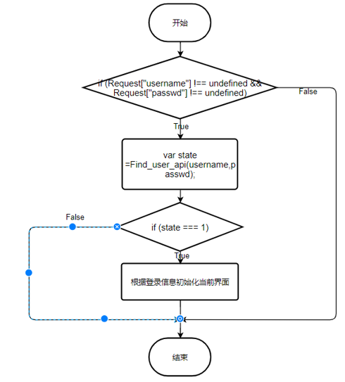

参数的测试用例表：

| IfLogin |  参数 username   | 参数 password |
| :-------------: | :--------------: | :--------: |
|       H1        |        空        |     空     |
|       H2        |        空        |   ‘12345’   |
|       H3        | 123456789@qq.com |     空     |
|       H4        | 123456789@qq.com |   ‘12345’   |
|       H5        | 123456789@qq.com |    ‘qwerty’(正确密码)     |

测试结果分析：

IfLogin函数功能正确，输入的样例均无问题。

####         ChangePass(newpass)

流程图：

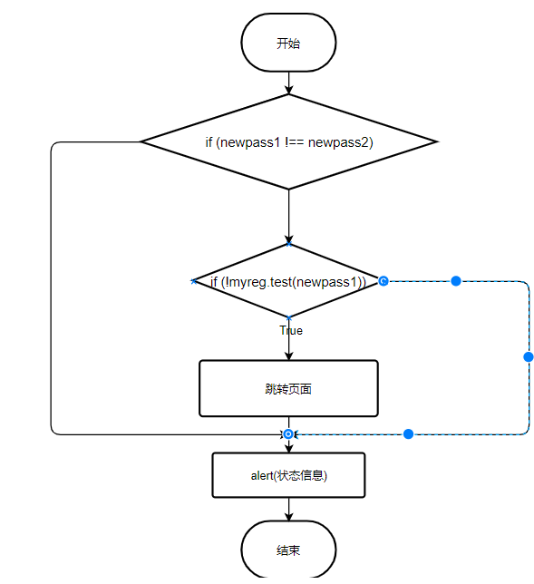

参数的测试用例表：
| ChangePass |    参数 newpass    |
| :------: | :----------------: |
|    I1    |         空         |
|    I2    | ‘qwerty’(原密码) |
|    I3    |      ‘asdfgh//++$$@!\|\|'(包含非法字符)     |
|    I4    |      ‘asdfgh’      |

测试结果分析：

ChangePass函数测试用例未产生bug。

####         Register(username,password)

流程图：

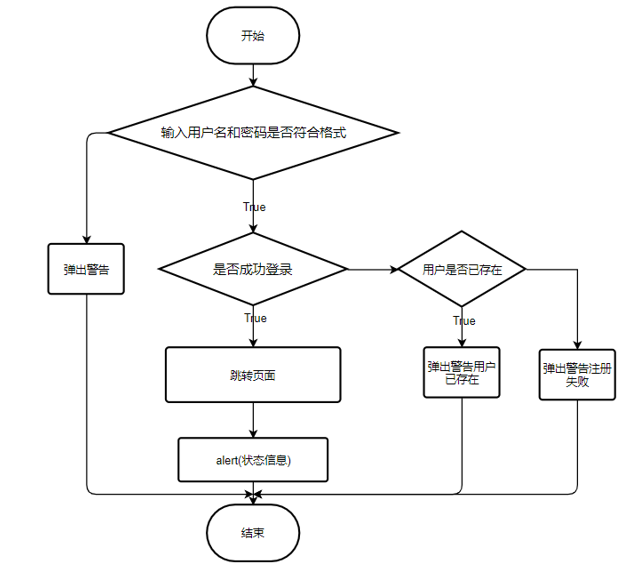

参数的测试用例表：
| Register |  参数 username   | 参数 password |
| :-------------: | :--------------: | :--------: |
|       J1        |        空        |     空     |
|       J2        |        空        |   ‘asdfgh//++$$@!\|\|'(包含非法字符) |
|       J3        |        空        |   ‘12345’   |
|       J4        | 123456789@qq.com |     空     |
|       J5        | !!%%$##|‘12345’|
|       J5        | 123456789@qq.com |   ‘12345’   |
|       J6        | 111111111@qq.com(账号未注册) |    ‘qwerty’     |
|       J7        | 123456789@qq.com |    ‘qwerty’(正确密码)     |

测试结果分析：

Register函数输入的测试用例正确通过测试。

### 测试软件

selenium

### 测试截图

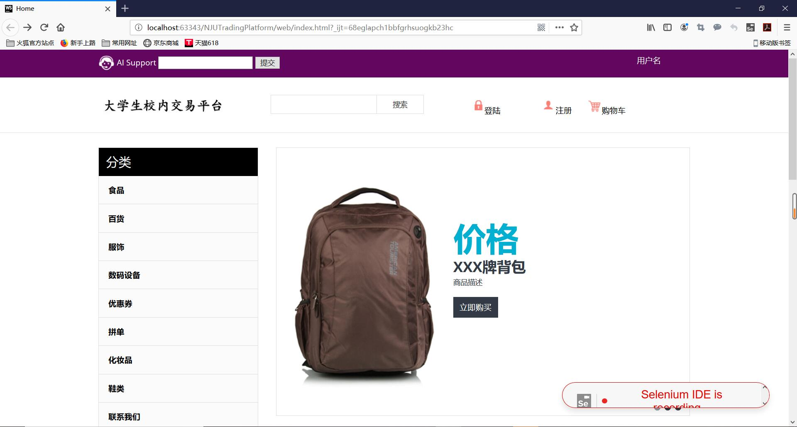

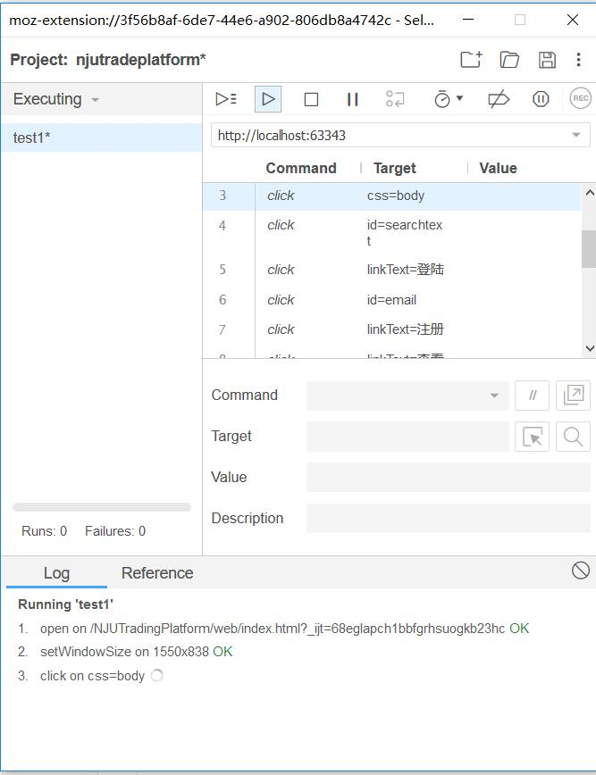

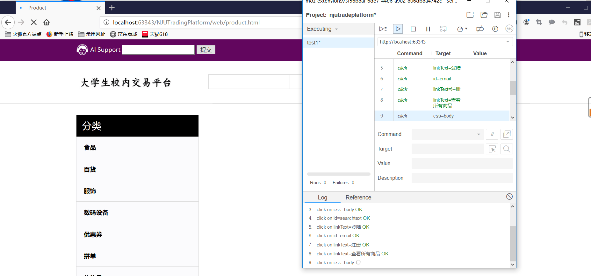

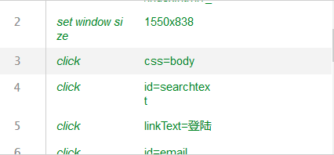

## 五、黑盒测试

### 用户登录

|      输入条件      |         有效等价类         |         无效等价类         |
| :----------------: | :------------------------: | :------------------------: |
|       用户名       |      已注册过的用户名      |       未注册的用户名       |
| 输入用户名格式正确 |       正常的邮箱地址       |       非邮箱地址形式       |
|  输入密码格式正确  |    由数字和英文字母组成    |         含特殊符号         |
|      输入长度      |          20位以内          |      0位，或超过20位       |
|  用户名密码相对应  | 已注册的正确的用户名和密码 | 已注册的用户名，但密码错误 |

有效测试用例：

| 测试数据                                                     | 期望结果 | 测试范围  |
| ------------------------------------------------------------ | -------- | --------- |
| [Username=123456@163.com](mailto:Username=123456@163.com)   Password=123456（已注册账号） | 登陆成功 | 1,2,3,4,5 |

无效测试用例：

| 测试数据                                                     | 期望结果         | 测试范围 |
| ------------------------------------------------------------ | ---------------- | -------- |
| [Username=223456@163.com](mailto:Username=223456@163.com)   Password=123456（未注册账号） | 不存在该账户     | 1        |
| [Username=123456asd163](mailto:Username=123456@163.com)   Password=123456 | 邮箱地址格式错误 | 2        |
| [Username=223456@163.com](mailto:Username=223456@163.com)   Password=123#@￥#￥ | 密码格式错误     | 3        |
| [Username=](mailto:Username=223456@163.com)   Password=123456 | 邮箱地址格式错误 | 2,4      |
| [Username=223456@163.com](mailto:Username=223456@163.com)   Password=123432443256（已注册账号，但密码错误） | 密码错误         | 5        |

### 用户注册

|      输入条件      |      有效等价类      |    无效等价类    |
| :----------------: | :------------------: | :--------------: |
|       用户名       |   未注册过的用户名   | 已注册过的用户名 |
| 输入用户名格式正确 |    正常的邮箱地址    |  非邮箱地址形式  |
|  输入密码格式正确  | 由数字和英文字母组成 |    含特殊符号    |
|      输入长度      |       20位以内       | 0位，或超过20位  |

有效测试用例：

| 测试数据                                                     | 期望结果 | 测试范围  |
| ------------------------------------------------------------ | -------- | --------- |
| [Username=333456@163.com](mailto:Username=333456@163.com)   Password=123456（已注册账号） | 注册成功 | 1,2,3,4,5 |

无效测试用例：

| 测试数据                                                     | 期望结果         | 测试范围 |
| ------------------------------------------------------------ | ---------------- | -------- |
| [Username=123456@163.com](mailto:Username=123456@163.com)   Password=123456（已注册账号） | 已存在该账户     | 1        |
| [Username=123456asd163](mailto:Username=123456@163.com)   Password=123456 | 邮箱地址格式错误 | 2        |
| [Username=223456@163.com](mailto:Username=223456@163.com)   Password=123#@￥#￥ | 密码格式错误     | 3        |
| [Username=](mailto:Username=223456@163.com)   Password=123456 | 邮箱地址格式错误 | 2,4      |

### 购买物品

| 输入条件 | 有效等价类                 | 无效等价类           |
| -------- | -------------------------- | -------------------- |
| 物品数量 | 购买数量小于等于库存且为正 | 购买量大于库存或为负 |
| 物品名称 | 正常展示的物品             | 不存在的物品         |

有效测试用例：

| 测试数据               | 期望结果 | 测试范围 |
| ---------------------- | -------- | -------- |
| 物品p1，add 3（库存5） | 购买成功 | 1,2      |

无效测试用例：

| 测试数据                      | 期望结果     | 测试范围 |
| ----------------------------- | ------------ | -------- |
| 物品p1，add 6                 | 添加数量过界 | 1        |
| 物品 p3 add 2（该物品不存在） | 不存在该商品 | 2        |

### 购物车

| 输入条件 |           有效等价类            |          无效等价类           |
| :------: | :-----------------------------: | :---------------------------: |
| 物品数量 | 添加/删除物品数量在库存范围之内 | 添加/删除物品数量超出库存范围 |
| 物品名称 |         正常展示的物品          |         不存在的物品          |

有效测试用例：

| 测试数据               | 期望结果 | 测试范围 |
| ---------------------- | -------- | -------- |
| 物品p1，add 3（库存5） | 添加成功 | 1,2      |

无效测试用例：

| 测试数据                      | 期望结果     | 测试范围 |
| ----------------------------- | ------------ | -------- |
| 物品p1，add 6                 | 添加数量过界 | 1        |
| 物品 p3 add 2（该物品不存在） | 不存在该商品 | 2        |

## 六、性能测试

### 1. 测试用例设计：
性能测试主要为测试网页吞吐量和响应速度，这里选取网页搜索功能为例，因为其是网页后端中查找表项和逻辑处理最多的部分，具体而言就是访问<http://172.26.22.71:2346/product.html?index=p>

### 2. 测试参数设计：
参考网上普遍采用的参数，设置10线程在1秒内启动，持续循环访问60秒；结果判断标准为返回状态码等于200。

### 3. 测试结果：

图形结果如下：

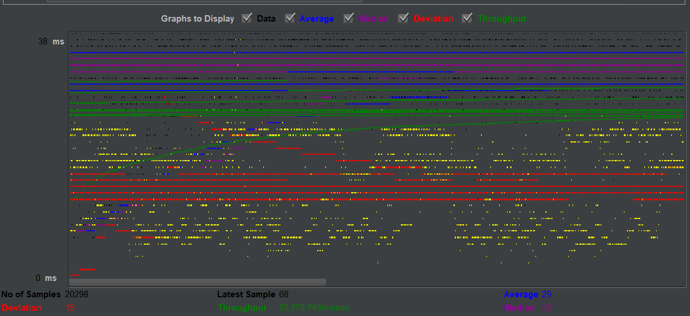

聚合报告分析如下：

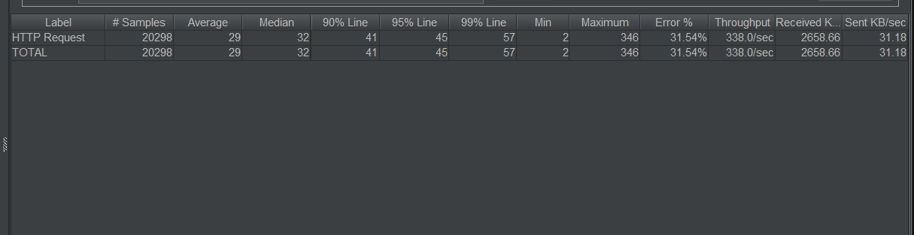

总体而言，因服务器后端为树莓派，处于校园网中，因此网速延迟低但同时接受请求的性能有限，具体而言为平均延迟29ms，每秒吞吐量有338次，每秒请求31.18KB同时答复2658.66KB

具体结果文件详见同目录下`aggregate.csv`和`HTTP Request.jmx`