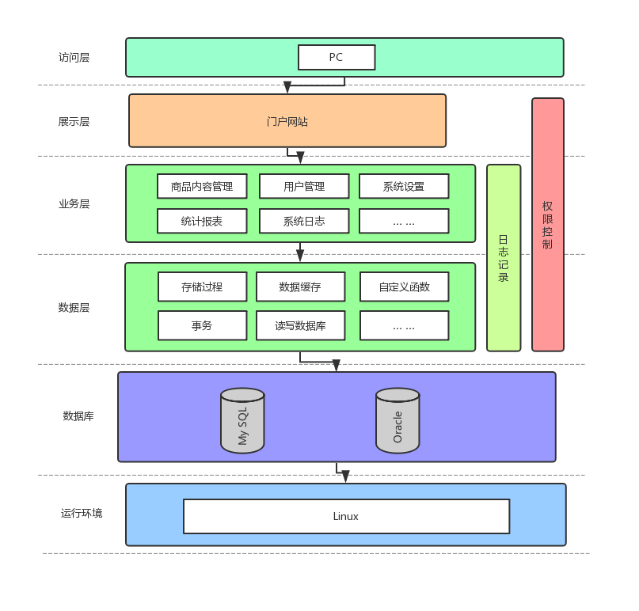
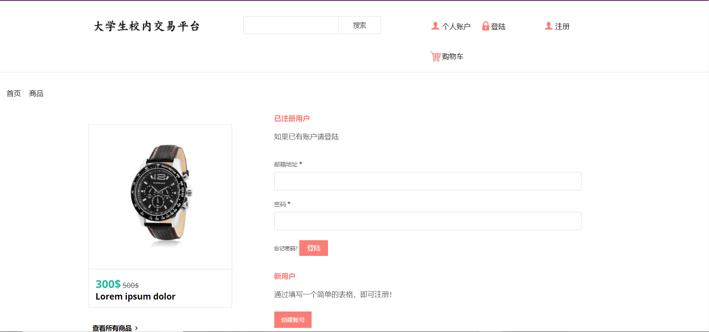
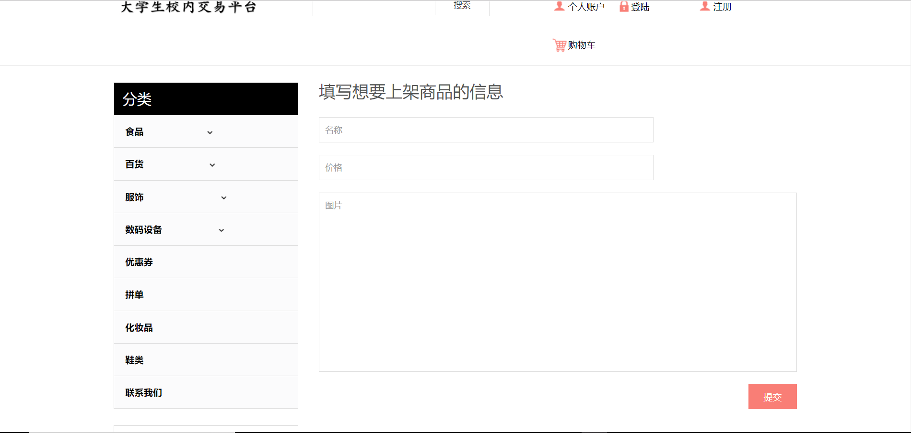
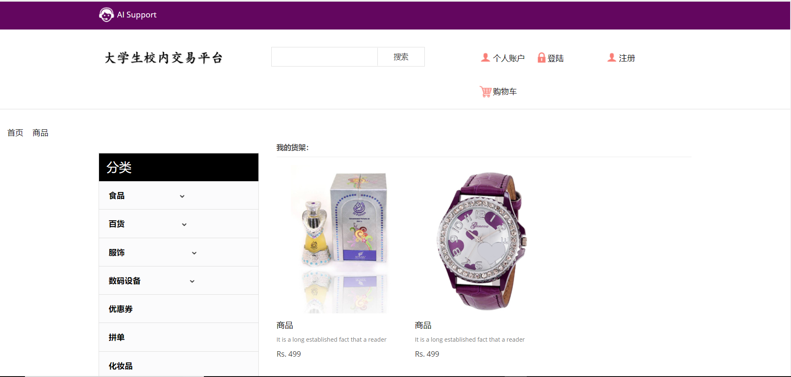

# 金融软件工程小组项目原型设计报告

## 小组成员及分工

- 袁满杰 算法设计
- 韦皓文 界面设计
- 季镇澜 后端实现
- 关一丁 数据支持

## 金融软件名称
NJU大学生校内交易平台

GitHub仓库：https://github.com/njutradingplatform/NJUTradingPlatform

## 项目背景

## 目标概述

## 功能体系和结构
### 项目功能
- 卖方的商品(二手物品、优惠券、拼单等)上架、编辑、接单功能；
- 买方的商品浏览、选购、下单、确认支付功能；
- 卖方与买方对话功能；
- 商品推荐；
- AI客服助手；
- 相关商品的平台(淘宝、京东等)比价推荐；

### 总体结构设计

### 运行环境

## 界面设计
### 首页

### 登录，注册界面

### 单个商品购买界面

### 商品选择界面

### 商家上架货物界面

### 个人的货架

### 我的购物车

